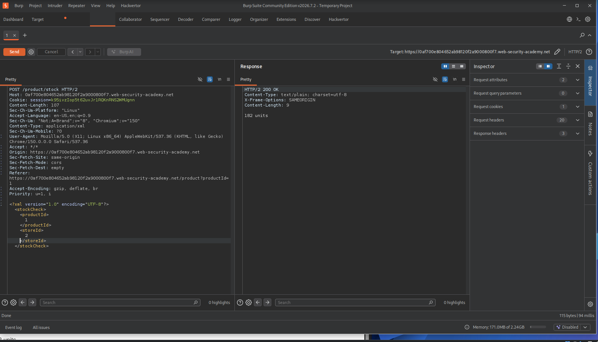
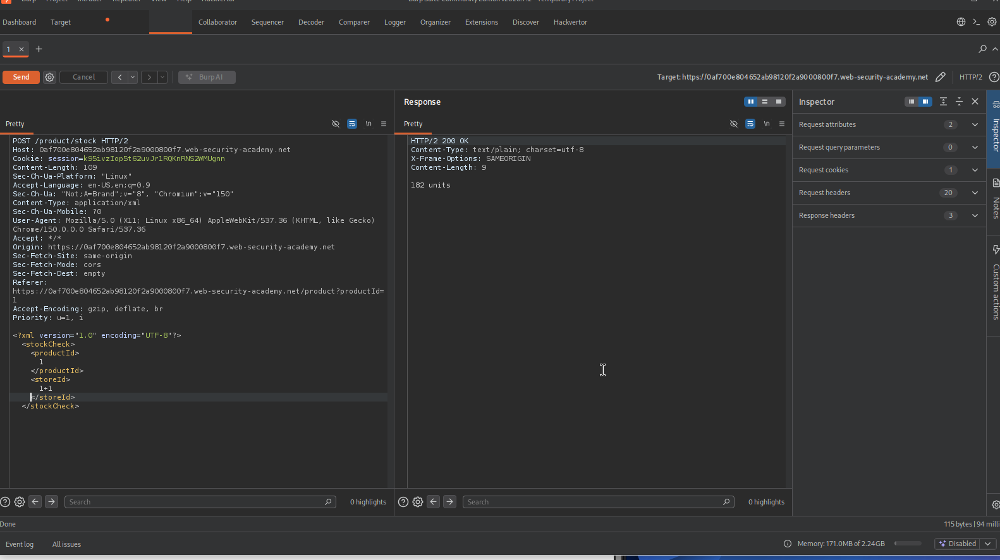
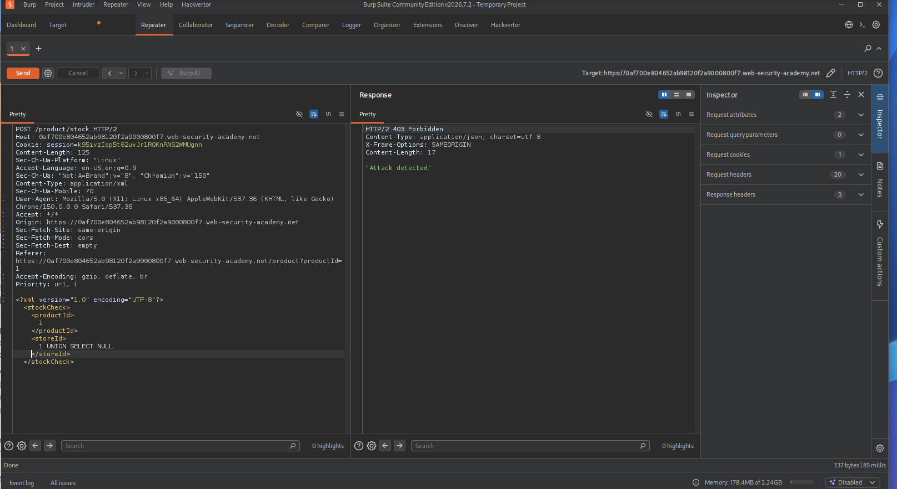
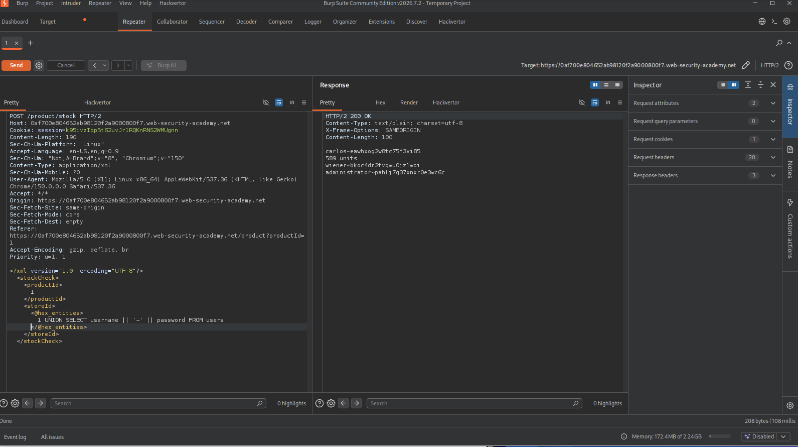
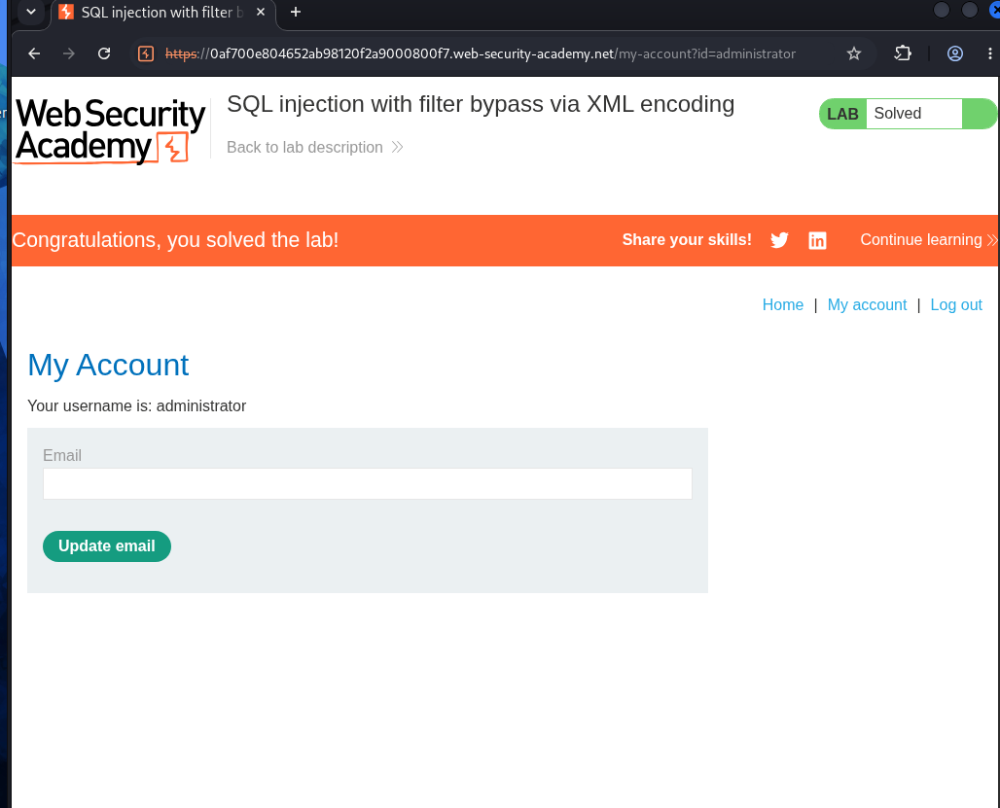

# SQL injection with filter bypass via XML encoding

## Vulnerability Summary

The store filtering feature is vulnerable to SQL injection through the storeId parameter. Although a WAF is in place, it can be bypassed using XML entity encoding, allowing an attacker to extract sensitive data from the database, including user credentials.

## Reconnaissance

- I selected a product, intercepted the request in Burp, and sent it to Repeater to work with it more easily.
- I noticed the request body had a `storeId` parameter inside XML tags. To check if it was being evaluated as part of a query rather than just treated as a literal value, I compared the response for `<storeId>2</storeId>` against `<storeId>1+1</storeId>`. Both returned the same result (182), which told me the value was actually being calculated by the database, not just matched as a string.
![[4.bmp]]

- Next step was figuring out the number of columns in the original query using `UNION SELECT NULL`, but this got blocked with an "Attack detected" response — meaning there's a WAF filtering the request before it reaches the query.

## Exploitation Steps

- When I first tried `1 UNION SELECT NULL` to figure out the column count, I noticed the response came back with "Attack detected" confirming the WAF was actively blocking SQL injection attempts before they reached the query.

- Since the injection point is inside an XML body, I used the Hackvertor extension in Burp to encode my payload as XML entities (hex or decimal). This way the payload doesn't look like SQL to the WAF's pattern matching, but it still gets decoded back into the real SQL syntax once it reaches the database.
- After encoding the payload with Hackvertor and testing it, I found out the original query only needed a single column one NULL was enough, meaning I didn't have to keep adding more columns to match.
- Payload: 1 UNION SELECT username || '-' || password FROM users
- Once encoded via Hackvertor and sent through, the WAF let it through and the query executed normally. The response came back with every username paired with its password, separated by a `-`, including the admin account: `administrator-pahlj7g37xnxr0e3wc6c`

- From there, I logged in using those credentials to complete the lab

## Impact

- This exposes the entire contents of the users table, including plaintext or hashed credentials for every account, including admin a full authentication bypass through direct database access.
- Since this is a UNION-based injection, the attacker isn't limited to the users table specifically, any table the database user has access to could potentially be dumped the same way.

## Root Cause 

- The application evaluates the storeId value as part of a SQL query instead of treating it as a fixed literal, allowing arbitrary SQL to be injected through it.

## What I Learned

- This lab showed me that WAFs filtering for literal SQL syntax can be bypassed just by changing the encoding of the payload, since the WAF and the database don't always "see" the same decoded value.
- I also got more comfortable with Hackvertor as a tool for encoding payloads on the fly inside Burp, which will be useful in future WAF-bypass scenarios.
