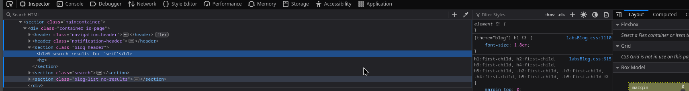

## Metadata

- **Difficulty:** APPRENTICE
- **Category:** XSS
- **Lab URL:** [Lab: Reflected XSS into HTML context with nothing encoded](https://portswigger.net/web-security/cross-site-scripting/reflected/lab-html-context-nothing-encoded)
- **Date Solved:** 25/8/2026
- **Tool useed:** BurpSuite

## Vulnerability Summary

Found a Reflected XSS vulnerability in the search field. Injected a JavaScript payload that triggers an alert() popup, confirming that malicious scripts can be injected and executed the same way.

## Exploitation Steps
1. First, I wanted to confirm whether the search field reflects user input. I tried entering a random value, for example "seif", and checked the response. Using the browser's Inspect tool, I noticed that the input was being reflected back in the page.

2. Next, I decided to capture the traffic using Burp Suite:
- Burp → Intercept on
- Searched again using "seif" to capture the request.

3. I checked the captured traffic and sent it to Repeater:

- Right-click on the request → Send to Repeater

4. Now, I opened Repeater and tried injecting a payload, for example:
``

Seif →  → Send

5. After confirming the payload works, I tried sending an alert to display "Hacked":
`Intercept → Seif → Forward`

**And with that, the vulnerability was successfully exploited.**

## Impact 

Since the search field reflects user input directly into the HTML response without any encoding or sanitization, an attacker can inject arbitrary JavaScript that executes in the victim's browser. By sending a crafted link to a victim, an attacker could steal session cookies, hijack the account, perform unauthorized actions on the victim's behalf, or redirect them to a phishing page. Because the input is reflected with zero encoding, any payload runs exactly as written, making exploitation straightforward and giving the attacker full control over what executes in the page context.

## What I Learned

I learned about Reflected XSS vulnerabilities and how to exploit them. I also learned how to use Repeater to modify and resend requests instead of stopping at Intercept every time. On top of that, I learned how to trigger an alert for users using JavaScript syntax

